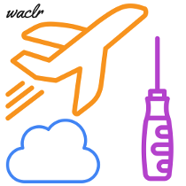

# **waclr**

[](https://travis-ci.org/wacl-york/waclr)



**waclr** is an R package for doing things at the Wolfson Atmospheric Chemistry Laboratory (WACL). 

## Installation

To install the development version the [**devtools**](https://github.com/hadley/devtools) package will need to be installed first. Then:

```
# Install waclr
devtools::install_github("wacl-york/waclr")
```

## Uses

**waclr** can be used to access air quality monitoring data which are maintained internally by WACL. For example, hourly monitoring data for a site which has the goal of capturing fracking activities in North Yorkshire can be accessed. To get data, the first step is to find what sites are desired. To get supported sites and other metadata use `get_wacl_sites`: 

```
# Load packages
library(dplyr)
library(waclr)

# Get metadata for sites which are serviced
data_sites <- get_wacl_sites()

# Print site names and region
data_sites %>% 
  select(site, 
         site_name,
         region)

  site            site_name          region
1 kirb      Kirby Misperton north_yorkshire
2 litp Little Plumpton Farm      lancashire
```

The site which is desired is Kirby Misperton (site code `kirb`). The site code is used in `get_wacl_data`:

```
# Get hourly data for two years for Kirby Misperton
data_kirb <- get_wacl_data(site = "kirb", year = 2016:2017, period = "hour")
```

Analysis can now be done with tools such as [**openair**](https://github.com/davidcarslaw/openair). 
